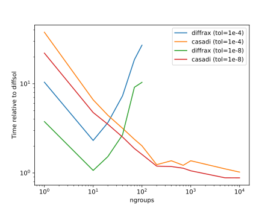

# Python (Diffrax & Casadi)

[Diffrax](https://docs.kidger.site/diffrax/) is a Python library for solving ODEs and SDEs implemented using JAX. [Casadi](https://web.casadi.org/) is a C++ library with Python and MATLAB bindings, for solving ODEs and DAEs, nonlinear optimisation and algorithmic differentiation. In this benchmark we compare the performance of the DiffSol implementation with the Diffrax and Casadi libraries.

As well as demonstrating the performance of the DiffSol library, this benchmark also serves as an example of how to wrap and use DiffSol in other languages. The code for this benchmark can be found [here](https://github.com/martinjrobins/diffsol_python_benchmark). The [maturin](https://www.maturin.rs/) library was used to generate a template for the Python bindings and the CI/CD pipeline neccessary to build the bindings, run pytest tests and build the wheels ready for distribution on PyPI. The [pyo3](https://github.com/PyO3/pyo3) library was used to wrap the DiffSol library in Python. 

## Problem setup

We will use the `robertson_ode` problem for this benchmark. This is a stiff ODE system with 3 equations and 3 unknowns, and is a common benchmark problem for ODE solvers. To illustrate the performance over a range of problem sizes we duplicated the equations by a factor of `ngroups`, so the number of equations is `3 * ngroups`.

For the Diffrax implementation we based this on the [example](https://docs.kidger.site/diffrax/examples/stiff_ode/) from the Diffrax documentation, extending this to include the `ngroups` parameter. As with the example, we used the `Kvaerno5` method for the solver. You can see the final implementation of the model [here](https://github.com/martinjrobins/diffsol_python_benchmark/blob/main/diffsol_python_benchmark/diffrax_models.py). 

For the Casadi implementation we wrote this from scratch using the libraries Python API. You can see the final implementation of the model [here](https://github.com/martinjrobins/diffsol_python_benchmark/blob/main/diffsol_python_benchmark/casadi_models.py).

The DiffSol implementation of the model was done using the DiffSL language, and you can see the final implementation of the model [here](https://github.com/martinjrobins/diffsol_python_benchmark/blob/main/diffsol_python_benchmark/diffsol_models.py).

The final implementation of the benchmark using these models is done [here](https://github.com/martinjrobins/diffsol_python_benchmark/blob/main/bench/bench.py). The DiffSol benchmark is done using the `bdf` solver. For `ngroup` < 20 it uses the `nalgebra` dense matrix and LU solver, and for `ngroups` >= 20 the `faer` sparse matrix and LU solver.

## Differences between implementations

There are a number of differences between the Diffrax, Casadi and DiffSol implementations that may affect the performance of the solvers. The main differences are:
- The Casadi implementation uses sparse matrices, whereas the DiffSol implementation uses dense matrices for `ngroups` < 20, and sparse matrices for `ngroups` >= 20. This will provide an advantage for DiffSol for smaller problems.
- I'm unsure if the Diffrax implementation uses sparse or dense matrices, but it is most likely dense, as JAX only has experimental support for sparse matrices. This will provide an advantage for DiffSol for larger problems.
- The Diffrax implementation uses the `Kvaerno5` method, which is a 5th order implicit Runge-Kutta method. This is different from the BDF method used by both the Casadi and DiffSol implementations. 
- Each library was allowed to use multiple threads according to their default settings. The only part of the DiffSol implementation that takes advantage of multiple threads is the `faer` sparse LU solver and matrix. Both the `nalgebra` LU solver / matrix, and the DiffSL generated code are single-threaded only. Diffrax uses JAX, which takes advantage of multiple threads (CPU only, no GPUs were used in these benchmarks). The Casadi implementation also uses multiple threads, but I'm unsure of the details.

## Results

The benchmarks were run on a Dell PowerEdge R7525 2U rack server, with dual AMD EPYC 7343 3.2Ghz 16C CPU and 128GB Memory. Each benchmark was run using both a low (1e-8) and high (1e-4) tolerances for both `rtol` and `atol`, and with `ngroup` ranging between 1 - 10,000. The results are presented in the following graphs, where the x-axis is the size of the problem `ngroup` and the y-axis is the time taken to solve the problem relative to the time taken by the DiffSol implementation (so `10^0` is the same time as DiffSol, `10^1` is 10 times slower etc.)

DiffSol is faster than both the Casadi and Diffrax implementations over the range of problem sizes and tolerances tested, although the Casadi and DiffSol implementations converge to be similar for larger problems (`ngroups` > 100). 

The region that DiffSol really outperforms the other implementations is for smaller problems (`ngroups` < 5), at `ngroups` = 1, Casadi and Diffrax are between 3 - 40 times slower than DiffSol. This small size region are where the dense matrix and solver used is more appropriate for the problem, and the overhead of the other libraries is more significant. The Casadi library needs to traverse a graph of operations to calculate each rhs or jacobian evaluation, whereas the DiffSL JIT compiler will compile to native code using the LLVM backend, along with low-level optimisations that are not available to Casadi. Diffrax as well is significantly slower than DiffSol for smaller problems, and this might be due to (a) Diffrax being a ML library and not optimised for solving stiff ODEs, and (b) double precision is used, which again is not a common use case for ML libraries.

As the problem sizes get larger, the performance of Diffrax and Casadi improve rapidly relative to DiffSol, but after `ngroups` > 10 the performance of Diffrax drops off again, probably due to JAX not taking advantage of the sparse structure of the problem. The performance of Casadi continues to improve, and for `ngroups` > 100 it is comparable to DiffSol. By the time `ngroups` = 10,000, the performance of Casadi is identical to DiffSol.